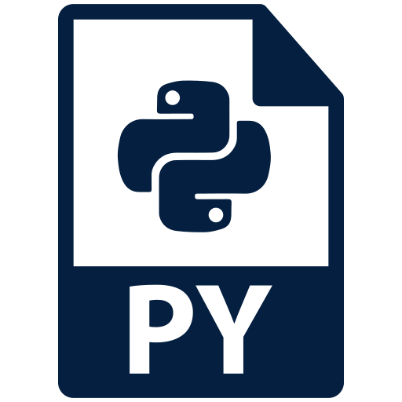

# Python_Projects
Projetos interessantes em python
  

  

# João Pedro Lavor
*Mathematical student and aspiring Data Scientist

Graduating in Bachelor of Mathematics (UFPE), focusing on applied mathematics and education. Areas of interest include Machine Larning, Statistic, Epidemology, Programming 
and other applied areas of mathematics.

**Background in:** Python, Machine Learning, Mathematics, Applied Mathematic .

**Links:**
* [Blog] 
* [LinkedIn](https://www.linkedin.com/in/jo%C3%A3o-pedro-lavor-65162312b/)
* [Medium](https://www.medium.com)

## Projects: The following projects are about subjects of my interest, i hope you like as much i do. 

* **
* **
* **
* **
* **
